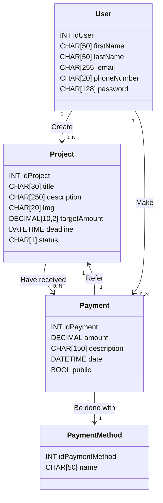

```mermaid
classDiagram
    %% direction LR

    class Project {
        INT idProject
        CHAR[30] title
        CHAR[250] description
        CHAR[20] img
        DECIMAL[10,2] targetAmount
        DATETIME deadline
        CHAR[1] status
    }

    class User {
        INT idUser
        CHAR[50] firstName
        CHAR[50] lastName
        CHAR[255] email
        CHAR[20] phoneNumber
        CHAR[128] password
    }

    class Payment {
        INT idPayment
        DECIMAL amount
        CHAR[150] description
        DATETIME date
        BOOL public
    }

    class PaymentMethod {
        INT idPaymentMethod
        CHAR[50] name
    }

    User "1" --> "0..N" Project : Create
    Project "1" --> "0..N" Payment : Have received
    User "1" --> "0..N" Payment : Make
    Payment "1" --> "1" PaymentMethod : Be done with
    Payment "1" --> "1" Project : Refer
```