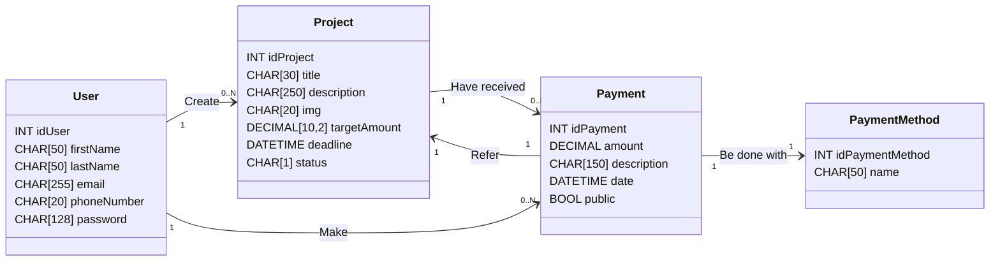

# 💭 Report EcoGreenU
## 1. Introduzione al progetto
EcoGreenU è una piattaforma web di crowdfunding nata con l’obiettivo di supportare progetti ecosostenibili e promuovere l’innovazione tecnologica orientata alla tutela dell’ambiente. Lo slogan *"Help create a better world"* riassume la missione della piattaforma: contribuire attivamente a costruire un futuro più sostenibile, un progetto alla volta.
Il progetto è stato sviluppato nell’ambito di un’attività scolastica finalizzata all’apprendimento delle tecnologie web, in particolare PHP, MySQL e JavaScript con il framework XAMPP per l’ambiente di sviluppo locale.

Il presente report descrive nel dettaglio l’architettura tecnica, le scelte progettuali e le funzionalità principali dell’applicazione, illustrando le motivazioni dietro a certe scelte.

> DA FINIRE

### da aggiungere
- perchè questo progetto
- perchè fatto in inglese
- stile UI
- struttura progetto
- tech stack
- class diagram
- istruzioni installazione


## 2. Analisi dei requisiti
Il progetto è stato sviluppato nel rispetto dei seguenti vincoli funzionali e tecnici:
- Compatibilità con XAMPP in configurazione nativa.
- Installazione tramite semplice copia della cartella nella directory `htdocs`.
- Tema chiaro e coerente, con un numero discreto di pagine.
- Connessione con database MySQL, sicuro da SQL injection.
- Interfaccia curata, con animazioni/transizioni.
- Form per l’inserimento e modifica dei contenuti.
- Interazione lato client tramite JavaScript.
- Visualizzazione, creazione, modifica e cancellazione di contenuti.
- Garantire un funzionamento corretto.
- Consegna del file `.sql` e del class diagram del database.


## 3. Progettazione
### 3.1 Architettura del sistema
- Struttura a livelli (frontend, backend, database)
- Flusso generale dell'applicazione

### 3.2 Progettazione del database
- Class Diagram
- Relazioni tra entità

### 3.3 Progettazione dell’interfaccia utente
- Scelte grafiche (colori, font, layout)
- Responsive design con Bootstrap


## 4. Implementazione
### 4.1 Struttura del progetto
La struttura usata per il progetto è nata dalla necessità di lavorare in modo organizzato e modulare, separando frontend e backend, permettendo di agire in modo più specifico su un singolo file senza andare ad intaccare gli altri. Di seguito viene proposto l'albero che rappresenta l'organizzazione di cartelle e file nel progetto:

```bash
/EcoGreenU
├── /docs                       # file di documentazione (class diagram, report, ecc.)
├── /src                        
|   ├── /assets
|   |   ├── /images             
|   |   |   ├── /about-us       # immagini per la pagina about-us
|   |   |   └── /projects       # copertine dei progetti
|   |   └── /logo               # varianti del logo EcoGreenU (navbar, favicon, ecc. con varianti light/dark mode) + progetto svg inkscape
|   ├── /css                    # fogli di stile css
|   ├── /js                     # script javascript
|   ├── /pages                  # pagine html (con estensione .php per usare le variabili php e cicli)
|   ├── /php                    # script php per il backend e la logica server-side
|   |   ├── /projects           # script php per le pagine riguardanti progetti (esplora, pagina dettagli, donazione, ecc.)
|   |   └── /user               # script php per le pagine riguardanti l'utente (registrazione, login, profilo, ecc.)
|   ├── /sql                     
|   |   └── 1-create-tables.sql # query CREATE TABLE
|   |   └── 2-insert-into.sql   # query INSERTO INTO
|   └── index.php               # homepage, la prima pagine che appare appena visitato il sito
└── README.md                   # README, il manifesto del progetto
```

### 4.2 Funzionalità principali
- CRUD dei progetti
- Sistema di login/registrazione sicuro
- Caricamento immagini
- Gestione dei pagamenti
- Protezione da SQL injection

### 4.3 Componenti interattivi
- JavaScript per validazione form e animazioni
- Messaggi di feedback per l’utente


## 5. Conclusioni
- Riflessioni finali sullo sviluppo
- Difficoltà incontrate e soluzioni adottate
- Possibili sviluppi futuri

---


