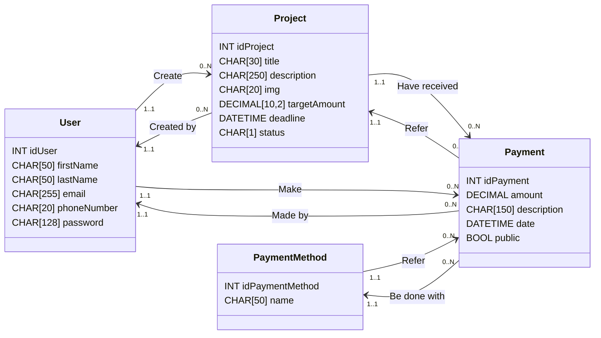

# 💭 Report EcoGreenU

> DA FINIRE

> specificare perchè non si possono eliminare progetti e soluzione (<1000$)


## 1. Introduzione al progetto
EcoGreenU è una piattaforma web di crowdfunding nata con l’obiettivo di supportare progetti ecosostenibili e promuovere l’innovazione tecnologica orientata alla tutela dell’ambiente. Lo slogan *"Help create a better world"* riassume la missione della piattaforma: contribuire attivamente a costruire un futuro più sostenibile, un progetto alla volta.
Il progetto è finalizzato all’apprendimento delle tecnologie web, in particolare PHP, MySQL e JavaScript con il framework XAMPP per l’ambiente di sviluppo locale.

Il presente report descrive nel dettaglio l’architettura tecnica, le scelte progettuali e le funzionalità principali dell’applicazione, illustrando le motivazioni dietro a certe scelte.


### 1.1. La scelta del tema
Questa idea è nata da una verifica svolta per la materia informatica, la cui consegna richiedeva l'analisi, la progettazione e lo sviluppo di un database per una realtà di crowdfunding per progetti ecosostenibili.
Assegnata la creazione di un progetto per la materia TPST, è stata colta l'occasione per concretizzare EcoGreenU, riadattandolo e sviluppando meglio l'idea iniziale.

### 1.2. Lo sviluppo in inglese
La decisione di sviluppare il progetto in lingua inglese (dal class diagram, al README, al database e alle pagine del sito) è dovuta alla volontà di mettere alla prova la conoscenza di questa lingua straniera.
La scelta di creare una repository pubblica su github si è rivelata essere poi un motivo aggiuntivo per usare la lingua inglese, in modo tale che possa fungere come un buon biglitto da visita per il profilo github.


## 2. Requisiti e vincoli progettuali
Il progetto è stato sviluppato nel rispetto dei seguenti vincoli:
- Compatibilità con XAMPP in configurazione nativa.
- Installazione tramite semplice copia della cartella nella directory `htdocs`.
- Tema chiaro e coerente, con un numero discreto di pagine.
- Connessione con database MySQL, sicuro da SQL injection.
- Interfaccia curata, con animazioni/transizioni.
- Form per l’inserimento e modifica dei contenuti.
- Interazione lato client tramite JavaScript.
- Visualizzazione, creazione, modifica e cancellazione di contenuti.
- Garantire un funzionamento corretto.
- Consegna del file `.sql` e del class diagram del database.


## 3. Progettazione
### 3.1. Architettura del sistema
L'architettura del sito è basata su un modello a tre livelli:
- Frontend, responsabile dell’interazione con l’utente, sviluppato in HTML, CSS (con la libreria Bootstrap) e JavaScript.
- Backend, sviluppato in PHP, gestisce la logica delle pagine e la comunicazione con il database.
- Database, realizzato in MySQL, memorizza le informazioni relative a utenti, progetti, finanziamenti e metodi di pagamento.

Il flusso dell'applicazione parte dall'interfaccia utente, che invia richieste HTTP (GET/POST) al server locale Apache. Quest’ultimo esegue query SQL sul database e restituisce i risultati, visualizzati dinamicamente all’utente.

### 3.2. Progettazione del database
A seguito di un'analisi preliminare del contesto preso in considerazione, è stato sviluppato il [class diagram](class-diagram.md) e sono state individuate le relazioni tra entità.



La base dati è stata portata in terza forma normale per garantire integrità, efficienza e sicurezza, evitando di perdere dati durante la manipolazione dei record.

### 3.3. Progettazione dell’interfaccia utente
L’interfaccia è pensata per essere semplice ma rimanendo intuitiva e facilmente accessibile dagli utenti, garantendo un'esperienza di navigazione fluida da diversi dispositivi (pc, smartphone, tablet, ecc.).

#### Scelte grafiche
Per la palette cromatica si è optato per l'utilizzo di verde e bianco, colori naturali, per comunicare l’identità ecosostenibile. La scelta di utilizzare dei bordi taglienti con un `border-radius: 0px`, in un era in cui si predilige un'interfaccia con gli angoli stondati e armonici, è un modo per differenziare EcoGreenU dalla concorrenza e dal resto del mondo.

L'aspetto default del sito, con un tema chiaro, è pensato per garantire un'alto contrasto che agevola la leggibilità dei contenuti, ideale per le persone con problemi di vista o per la navigazione in luoghi con molta luce.
E' stato poi introdotto il tema scuro, che scurisce lo sfondo del sito, pensato appositamente per la navigazione in orari notturni o in luoghi di scarsa illuminazione, evitando di sforzare la vista.

La scelta del font è ricaduta su [`Funnel Display`](https://fonts.google.com/specimen/Funnel+Display), parte della famiglia sans-serif, che coniuga professionalità e informalità garantendo sempre un'alta leggibilità.

#### Design responsive
La responsivity del sito è garantita dalla libreria CSS [Bootstrap](https://getbootstrap.com/), tramite l'utilizzo del `display: flex` e del layout a griglia con `row` e `col`. L’interfaccia e il layout dei contenuti si adattano automaticamente alle dimensioni dello schermo, rendendo fluida la navigazione da dispositivi desktop, tablet e smartphone.


## 4. Implementazione
### 4.1. Struttura del progetto
L'organizzazione di cartelle e file usata per il progetto è nata dalla necessità di poter lavorare in modo modulare e scalabile, separando frontend e backend, e permettendo una facile manutenzione sui singoli file.
Di seguito, l'albero che rappresenta l'organizzazione di cartelle e file nel progetto:

```bash
/EcoGreenU
├── /docs                       # file di documentazione (class diagram, report, ecc.)
├── /src                        
|   ├── /assets
|   |   ├── /images             
|   |   |   ├── /about-us       # immagini per la pagina about-us
|   |   |   └── /projects       # copertine dei progetti
|   |   └── /logo               # varianti del logo EcoGreenU (navbar, favicon, ecc. con varianti light/dark mode) + progetto svg inkscape
|   ├── /css                    # fogli di stile css
|   ├── /js                     # script javascript
|   ├── /pages                  # pagine html (con estensione .php per usare le variabili php e cicli)
|   ├── /php                    # script php per il backend e la logica server-side
|   |   ├── /projects           # script php per le pagine riguardanti progetti (esplora, pagina dettagli, donazione, ecc.)
|   |   └── /user               # script php per le pagine riguardanti l'utente (registrazione, login, profilo, ecc.)
|   ├── /sql                     
|   |   └── 1-create-tables.sql # query CREATE TABLE
|   |   └── 2-insert-into.sql   # query INSERTO INTO
|   └── index.php               # homepage, la prima pagine che appare appena visitato il sito
└── README.md                   # manifesto del progetto
```

### 4.2. Funzionalità principali
> DA FARE
- CRUD dei progetti
- Sistema di login/registrazione sicuro
- Caricamento immagini
- Gestione dei pagamenti
- Protezione da SQL injection con prepared statements e parameters


## 5. Istruzioni per l'installazione
Per installare e testare il progetto sono sufficienti pochi passaggi:
1. Clona la repository.
2. Spostala nella cartella `htdocs` (all'interno di XAMPP).
3. Avvia Apache e MySQL tramite il pannello di controllo di XAMPP.
4. Importa il database tramite phpMyAdmin, incollando le query all'interno di `src/utils/dbEcoGreenU.sql` (prima le create table e poi le insert into).
5. All'interno del browser, naviga alla pagina principale del progetto (dovrebbe essere `localhost/EcoGreenU/src/index.php`).


## 6. Conclusioni
### 6.1. Riflessioni finali sullo sviluppo
Il progetto EcoGreenU ha rappresentato un'importante opportunità di apprendimento pratico grazie all'applicazione concreta dei concetti teorici appresi in un contesto realistico.
Grazie a questo lavoro, è stato possibile approfondire e consolidare conoscenze su linguaggi e strumenti come PHP, MySQL, JavaScript, HTML e CSS, nonché su concetti come la progettazione responsive e la l'interazione sicura con i database.

### 6.2. Possibili sviluppi futuri
Il progetto, pur essendo completo nelle sue funzionalità principali, potrebbe essere ulteriormente ampliato in futuro, aggiungendo:
- Dashboard per gli amministratori, per gestire i contenuti e moderare i progetti e gli utenti.
- Sistema di valutazione dei progetti.
- Opzioni di ricerca avanzata dei progetti, permettendo di filtrare la ricerca in base a parametri come la cifra target, lo stato del progetto, la data di creazione, ecc.
- Sistema che permette di seguire i progetti, rimanendo aggiornati sui progressi e gli eventi.
- Notifiche email per aggiornamenti su pagamenti o progetti.
- Internazionalizzazione, rendendo la piattaforma disponibile in più lingue per permettere la fruizione del servizio in altri Paesi.
- Funzionalità social come il follow tra utenti.