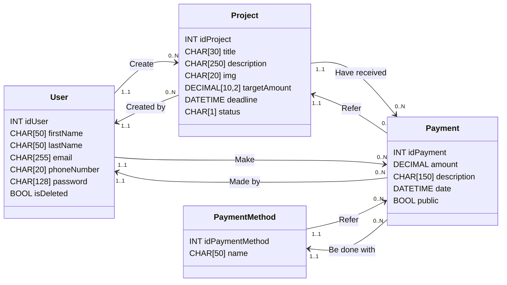

# 💭 Report EcoGreenU

> **DA FINIRE**

## 1. Introduzione al progetto
EcoGreenU è una piattaforma web di crowdfunding nata con l’obiettivo di supportare progetti ecosostenibili e promuovere l’innovazione tecnologica orientata alla tutela dell’ambiente. Lo slogan *"Help create a better world"* riassume la missione della piattaforma: contribuire attivamente a costruire un futuro più sostenibile, un progetto alla volta.
Il progetto è finalizzato all’apprendimento delle tecnologie web, in particolare PHP, MySQL e JavaScript con il framework XAMPP per l’ambiente di sviluppo locale.

Il presente report descrive nel dettaglio l’architettura, le scelte progettuali e le funzionalità principali della piattaforma, illustrando le motivazioni dietro a certe scelte.


### 1.1. La scelta del progetto
Questa idea è nata da una verifica svolta per la materia informatica, la cui consegna richiedeva l'analisi, la progettazione e lo sviluppo di un database per una realtà di crowdfunding per progetti ecosostenibili, EcoGreenU.
Sopraggiunta la consegna di un progetto per la materia TPST, è stata colta l'occasione per concretizzare EcoGreenU, riadattando e sviluppando concretamente l'idea iniziale.

### 1.2. Lo sviluppo in inglese
La decisione di sviluppare il progetto in lingua inglese (dal class diagram al README, dal database alle pagine del sito) è dovuta alla volontà di mettere alla prova la conoscenza della medesima lingua.
La scelta di creare una repository pubblica su github è stata un motivo aggiuntivo per usare la lingua inglese, in modo tale che possa fungere come un buon biglitto da visita per il profilo github.


## 2. Requisiti e vincoli progettuali
Il progetto è stato sviluppato nel rispetto dei seguenti vincoli:
- Compatibilità con XAMPP in configurazione nativa.
- Installazione tramite semplice copia della cartella nella directory `htdocs`.
- Tema chiaro e coerente, con un numero discreto di pagine.
- Connessione con database MySQL, sicuro da SQL injection.
- Interfaccia curata, con animazioni/transizioni.
- Form per l’inserimento e modifica dei contenuti.
- Interazione lato client tramite JavaScript.
- Visualizzazione, creazione, modifica e cancellazione di contenuti.
- Garantire un funzionamento corretto.
- Consegna del file `.sql` e del class diagram del database.


## 3. Progettazione
### 3.1. Architettura del sistema
L'architettura del sito è stata pensata per svilupparsi su tre livelli distinti:
- Frontend, responsabile dell’interazione con l’utente, sviluppato in HTML, CSS (con la libreria Bootstrap) e JavaScript.
- Backend, sviluppato in PHP, gestisce la logica delle pagine e la comunicazione con il database.
- Database, realizzato con MySQL, memorizza le informazioni relative a utenti, progetti, finanziamenti e metodi di pagamento.

### 3.2. Progettazione del database
A seguito di un'analisi preliminare del contesto preso in considerazione, è stato sviluppato il [class diagram](class-diagram.md) e sono state individuate le relazioni tra entità.



La base di dati è stata portata in terza forma normale per garantire integrità, efficienza e sicurezza, evitando di perdere dati durante la manipolazione dei record.

### 3.3. Progettazione dell’interfaccia utente
L’interfaccia è pensata per essere semplice, rimanendo intuitiva e facilmente accessibile dagli utenti, per garantire un'esperienza di navigazione fluida da diversi dispositivi (pc, smartphone, tablet, ecc.).

#### 3.3.1. Scelte grafiche
Per la palette cromatica si è optato per l'utilizzo di verde e bianco, colori naturali, per comunicare l’identità ecosostenibile. La scelta di utilizzare dei bordi taglienti, in un era in cui si predilige un'interfaccia con gli angoli stondati e armonici, è una sperimentazione stilistica e un tentativo di differenziare EcoGreenU dalla concorrenza.

L'aspetto default del sito, con un tema chiaro, è pensato per garantire un'alto contrasto che agevola la leggibilità dei contenuti, ideale per una navigazione normale o in luoghi molto illuminati.
E' stato poi introdotto il tema scuro, che scurisce lo sfondo del sito, pensato appositamente per la navigazione in orari notturni o in luoghi di scarsa illuminazione, evitando un'eccessivo sforzo visivo.

La scelta del font è ricaduta su [`Funnel Display`](https://fonts.google.com/specimen/Funnel+Display), della famiglia sans-serif, che coniuga professionalità e informalità ma garantendo sempre un'alta leggibilità.

#### 3.3.2. Design responsive
La responsivity del sito è garantita dalla libreria CSS [Bootstrap](https://getbootstrap.com/), tramite l'utilizzo del `display: flex` e del layout a griglia con `row` e `col`. L’interfaccia e il layout dei contenuti si adattano automaticamente alle dimensioni dello schermo, rendendo fluida la navigazione da dispositivi di diverse dimensioni (desktop, tablet, smartphone, ecc.).


## 4. Implementazione
### 4.1. Struttura del progetto
L'organizzazione di cartelle e file usata per il progetto è nata dalla necessità di lavorare in modo modulare e scalabile, separando frontend e backend e permettendo una facile manutenzione dei singoli script o pagine.
Di seguito, al struttura della directory del progetto:

```bash
/EcoGreenU
├── /docs                       # file di documentazione (class diagram, report, ecc.)
├── /src                        
|   ├── /assets
|   |   ├── /images             
|   |   |   ├── /about-us       # immagini per la pagina about-us
|   |   |   └── /projects       # copertine dei progetti
|   |   └── /logo               # varianti del logo EcoGreenU (navbar, favicon, ecc. con varianti light/dark mode) + progetto svg inkscape
|   ├── /css                    # fogli di stile css
|   ├── /js                     # script javascript
|   ├── /pages                  # pagine html (con estensione .php per usare le variabili e i costrutti php)
|   ├── /php                    # script php per il backend e la logica server-side
|   |   ├── /projects           # script php per le pagine riguardanti progetti (esplora, pagina dettagli, donazione, ecc.)
|   |   └── /user               # script php per le pagine riguardanti l'utente (registrazione, login, profilo, ecc.)
|   ├── /shared                 # componenti/file riutilizzabili
|   ├── /sql                     
|   |   └── 1-create-tables.sql # query CREATE TABLE
|   |   └── 2-insert-into.sql   # query INSERT INTO
|   └── index.php               # homepage, la prima pagina che appare appena visitato il sito
└── README.md                   # manifesto del progetto
```

### 4.2. Funzionalità principali
Ad ora, le funzionalità principali della piattaforma comprendono:
- Operazioni CRUD sui progetti (creazione, visualizzazione, modifica e rimozione).
- Login e registrazione utente.
- Visualizzazione di tutti i progetti caricati sulla piattaforma, con la possibilità di cercarli.
- Creazione di un nuovo progetto, con caricamento di un'immagine rappresentativa.
- Donazione a progetti esistenti e aperti.
- Modifica profilo utente.
- Modifica progetti esistenti.
- Protezione da SQL injection con prepared statements e parameters.

### 4.3. Difficoltà riscontrate
Come da requisito, all'utente dev'essere permesso di visualizzare, aggiungere, modificare e *cancellare* dei contenuti.
Tuttavia, durante la fase di implementazione, sono stati riscontrati alcuni problemi riguardandi specialmente operazioni di cancellazione.

#### 4.3.1. Rimozione di contenuti
Durante l'implementazione delle funzionalità CRUD sui progetti, è stato riscontrato un importante problema in merito alla cancellazione dei progetti: si è ragionato sul fatto che un progetto non dovrebbe poter essere eliminato, specie se sono state effettuate delle donazioni da parte di utenti (a cui non piacerebbe sicuramente vedere i propri soldi sparire nel nulla).

Per risolvere il problema si è quindi deciso che la cancellazione di un progetto può avvenire solo nel caso in cui la cifra totale donata non superi i 1000\$. In tal caso, il proprietario del progetto potrà procedere con la rimozione del progetto, e gli utenti che hanno effettuato delle donazioni verranno rimborsati del corrispondente importo versato.
Nel caso in cui la cifra totale donata superi i 1000\$, l'eliminazione del progetto non sarà più resa possibile.

#### 4.3.2. Cancellazione del profilo utente
Durante l'implementazione della modifica del profilo utente, sono stati riscontrati dei problemi con l'eliminazione del profilo utente. Infatti, la cancellazione fisica di un utente, rimuovendo il record dal database, comporterebbe significanti ripercussioni sulla sicurezza e l'integrità della base di dati, andando a violare i vincoli di integrità referenziale delle chiavi esterne sulle tabelle.

Per risolvere il problema, si è optato per aggiungere un campo booleano `isDeleted` in `tblUsers`, che di default ha valore `FALSE`, per indicare se il profilo è ancora attivo o se è stato "eliminato". Nel caso in cui il profilo sia ancora attivo, l'utente può effettuare il login dall'apposita pagina; in caso contrario, l'utente non avrà più alcun controllo sul profilo e non sarà più possibile accedervi, ma i progetti creati e le donazioni effettuate rimarranno comunque registrate.

## 5. Istruzioni per l'installazione
Per installare e testare il progetto sono sufficienti pochi passaggi:
1. Clona la repository.
2. Spostala nella cartella `htdocs` (all'interno di XAMPP).
3. Avvia Apache e MySQL tramite il pannello di controllo di XAMPP.
4. Importa il database tramite phpMyAdmin, eseguendo le query all'interno di `src/sql/` (prima il `CREATE DATABASE`, poi, nella console di dbEcoGreenU le `CREATE TABLE` e infine le `INSERT INTO`).
5. All'interno del browser, naviga alla pagina principale del progetto (dovrebbe essere in `localhost/EcoGreenU/src/index.php`).


## 6. Conclusioni
### 6.1. Riflessioni finali sullo sviluppo
Il progetto EcoGreenU ha rappresentato un'importante opportunità di apprendimento pratico grazie all'applicazione concreta dei concetti teorici appresi in un contesto realistico.
Grazie a questo lavoro, è stato possibile approfondire e consolidare conoscenze su linguaggi e strumenti come PHP, MySQL e JavaScript, ma anche su concetti quali la progettazione responsive e l'interazione sicura con i database.

### 6.2. Possibili sviluppi futuri
Il progetto, pur essendo completo nelle sue funzionalità principali, potrebbe essere ulteriormente ampliato in futuro, aggiungendo:
- Dashboard per gli amministratori, per gestire i contenuti e moderare i progetti e gli utenti.
- Sistema di valutazione dei progetti.
- Opzioni di ricerca avanzata dei progetti, permettendo di filtrare la ricerca in base a parametri come la cifra target, lo stato del progetto, la data di creazione, ecc.
- Sistema che permette di seguire i progetti, rimanendo aggiornati sui progressi raggiunti.
- Notifiche email per aggiornamenti su pagamenti o progetti.
- Supporto multi-lingua, per permettere la fruizione del servizio in altri Paesi del mondo.
- Funzionalità social come il follow tra utenti.